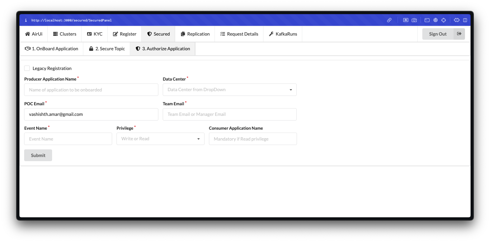
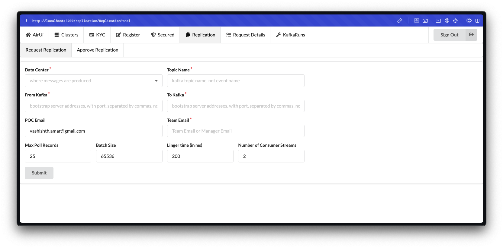
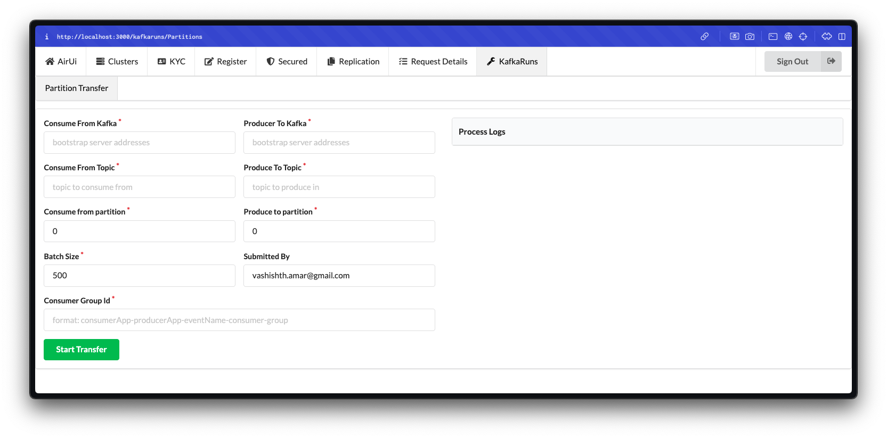

## AirUi: Airbus System Management Interface

AirUi is a robust interface designed to assist clients in efficiently performing
both fundamental and advanced operations related to Airbus' Kafka management
system. The platform is built to enhance system observability, security, and
scalability, enabling seamless management of clusters and topics.

### Key Features:

#### Clusters Dashboard

The Clusters dashboard offers a comprehensive overview of all clusters, enabling
users to monitor their health and access critical information at a glance. This
functionality serves as a centralized hub for quick assessments of cluster
status and performance metrics.

#### Know Your Consumer (KYC)

The KYC module provides in-depth insights into Kafka topics, including:

- Ownership details (e.g., the responsible team)
- Usage context and associated applications
- Technical associations with clusters
- Details on producers, consumers, and consumer groups linked to each topic

This feature ensures better governance and understanding of data flows across
the organization.

#### Registration

The Registration module facilitates the registration of both applications and
topics, ensuring efficient onboarding and integration with the Kafka ecosystem.

#### Secured Topics Management

The Secured Topics functionality is tailored for handling Personally
Identifiable Information (PII). It enables:

- Secure onboarding of sensitive topics
- Configuration of security policies and permissions
- Incremental authorization for access by other applications

This feature ensures compliance with privacy regulations and enhances data
protection.

#### Topic Replication

The Replication functionality allows clients to configure topic replication
strategies using available resources, such as threads and servers. It offers
flexibility in terms of:

- Aggressiveness of replication
- Selection of data centers for replication
- Support for both cross-data center and intra-data center replication

This capability ensures data redundancy, high availability, and disaster
recovery.

#### Request Status and Tracking

The Request Details feature provides users with real-time status updates on
submitted requests. It includes detailed logs of responses and the processing
lifecycle, helping to streamline request management.

#### Kafka Operations Execution (KafkaRuns)

The KafkaRuns module allows users to perform operations such as consuming a
topic from one cluster and producing it to another. This functionality supports
real-time visibility of operation logs through web sockets, ensuring
transparency and traceability of data flows.

